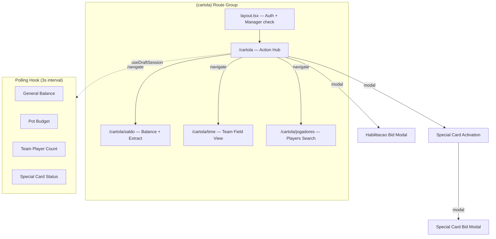

# Cartola Draft Portal

## Architecture Overview



---

## 1. DB Migration

### 1a. Link managers to auth users

Add `user_id` column on `managers` table to connect a Supabase Auth user to their manager identity.

```sql
ALTER TABLE public.managers
  ADD COLUMN user_id uuid UNIQUE REFERENCES auth.users(id);
```

Admin will manually assign Supabase Auth accounts to managers (set `user_id` after creating the user).

### 1b. Player favorites table

```sql
CREATE TABLE public.draft_player_favorites (
  id uuid PRIMARY KEY DEFAULT gen_random_uuid(),
  championship_manager_id uuid NOT NULL REFERENCES public.championship_managers(id),
  registration_id uuid NOT NULL REFERENCES public.championship_registrations(id),
  created_at timestamptz DEFAULT now(),
  UNIQUE (championship_manager_id, registration_id)
);
```

### 1c. Supabase RPC for atomic special card activation

A database function that handles the race condition when two cartolas press the special card button simultaneously. Uses `SELECT ... FOR UPDATE` to serialize access.

```sql
CREATE OR REPLACE FUNCTION activate_special_card(
  p_championship_id uuid,
  p_cm_id uuid,
  p_pot_number integer,
  p_pot_position text,
  p_target_registration_id uuid
) RETURNS json AS $$
DECLARE
  v_existing uuid;
  v_already_used boolean;
  v_new_id uuid;
BEGIN
  -- Check if this cartola already used their card
  SELECT EXISTS(
    SELECT 1 FROM draft_special_card_uses
    WHERE championship_id = p_championship_id
      AND activated_by_cm_id = p_cm_id
  ) INTO v_already_used;

  IF v_already_used THEN
    RETURN json_build_object('success', false, 'reason', 'card_already_used');
  END IF;

  -- Attempt insert (unique constraint handles the race)
  INSERT INTO draft_special_card_uses (
    championship_id, activated_by_cm_id, pot_number,
    pot_position, target_registration_id, result
  ) VALUES (
    p_championship_id, p_cm_id, p_pot_number,
    p_pot_position, p_target_registration_id, 'purchased'
  )
  RETURNING id INTO v_new_id;

  RETURN json_build_object('success', true, 'id', v_new_id);
EXCEPTION
  WHEN unique_violation THEN
    RETURN json_build_object('success', false, 'reason', 'card_already_used');
END;
$$ LANGUAGE plpgsql;
```

---

## 2. Install shadcn components

Need to add via CLI: **Slider**, **Tabs**, **Sheet** (mobile-friendly bottom drawer).

```bash
npx shadcn@latest add slider tabs sheet
```

Existing components already available: Dialog, Button, Badge, Card, Input, Select, Label.

---

## 3. Route Group and Layout

### File: `app/(cartola)/layout.tsx`

Server component layout that:
1. Calls `getUserRole()` from [lib/auth.ts](lib/auth.ts) -- redirect to `/login` if unauthenticated
2. Verifies `role === 'manager'` -- redirect if not a manager
3. Fetches the manager record linked to the user via `managers.user_id`
4. Fetches `championship_managers` to find which championship the manager belongs to
5. Wraps children in a `CartolaDraftProvider` context (provides `managerId`, `championshipManagerId`, `championshipId`)

Layout shell: **no sidebar**, full-screen dark background, bottom-safe padding for mobile, a simple top header bar with the manager's name/team and back navigation.

```
(cartola)/
  layout.tsx
  cartola/
    page.tsx            -- Dashboard hub
    saldo/
      page.tsx          -- Balance + extract
    time/
      page.tsx          -- Team field view
    jogadores/
      page.tsx          -- Player search + favorites
```

All routes render at `/cartola`, `/cartola/saldo`, `/cartola/time`, `/cartola/jogadores`.

---

## 4. Main Dashboard — `/cartola`

Client component. **Mobile-first grid of action cards** with the current balance prominently displayed at the top.

### Layout (mobile):
- Top: Manager name + team badge + general balance (large number)
- Below: Current pot info badge (e.g., "Pote 2 — ATA em andamento")
- Grid of action cards (2 columns on mobile, 3 on tablet/desktop):
  1. **Saldo e Extrato** — navigates to `/cartola/saldo`
  2. **Lance de Habilitacao** — opens modal (inline)
  3. **Carta Especial** — activates card / opens bid modal
  4. **Meu Time** — navigates to `/cartola/time` — shows player count badge (e.g., "4/10")
  5. **Jogadores** — navigates to `/cartola/jogadores`

### Polling — `useDraftSession` hook

Custom hook in `features/hooks/useDraftSession.ts`:
- `setInterval` every 3 seconds calling a data-fetching function
- Fetches via browser Supabase client in a single batch:
  - `championship_managers` row (current_balance, initial_balance)
  - `draft_pot_budgets` for the active pot (remaining_budget)
  - `championship_team_players` count for this manager's team
  - `draft_special_card_uses` to check if card has been used
  - `draft_player_purchases` count
- Returns: `{ balance, potBudget, teamCount, hasUsedSpecialCard, isLoading, ... }`
- Cleans up interval on unmount

### Habilitacao Bid Modal

Uses shadcn **Dialog** component:
- Title: "Lance de Habilitacao — Pote X (ATA)"
- **Slider** component from CC$1,000 to `currentBalance` (step CC$1,000)
- Display of selected amount in large gold text
- "Confirmar Lance" button
- POST to `/api/draft/qualification-bid` which inserts into `draft_qualification_bids` + creates a `POT_BID_RESERVE` transaction + updates `current_balance`

### Special Card Flow

Two-step UI:
1. **Activate button** on dashboard — calls Supabase RPC `activate_special_card` (atomic)
   - On success: shows "Carta ativada!" and opens the bid modal
   - On failure: toast "Outro cartola ja ativou a carta primeiro"
2. **Special Card Bid Modal** (Dialog):
   - Slider from CC$0 to `potBudget.remaining_budget` (step CC$1,000)
   - 20-second countdown timer displayed prominently
   - "Confirmar Lance" button
   - POST to `/api/draft/special-card-bid`

---

## 5. Balance Page — `/cartola/saldo`

Client component with two sections:

### Top section: Balance cards
- **General Balance**: large number card showing `current_balance` / `initial_balance`
- **Pot Budget** (if active): remaining_budget / initial_budget with a progress bar

### Bottom section: Transaction extract
- Fetches `draft_balance_transactions` ordered by `created_at DESC`
- Each row: icon by type + description + amount (green for credit, red for debit) + timestamp
- Filter tabs: "Todos" | "Pote Atual"

Uses existing pattern: `useEffect` + Supabase browser client, similar to [features/hooks/useManagers.ts](features/hooks/useManagers.ts).

---

## 6. Team Page — `/cartola/time`

Client component with a **football field SVG/CSS layout**.

### Field layout:
```
           [  GOL  ]         <-- 1 slot
        [ ZAG ][ ZAG ]       <-- flexible row
     [ MEI ][ MEI ][ MEI ]   <-- flexible row
        [ ATA ][ ATA ]       <-- flexible row
```

- Fetch `championship_team_players` joined with `championship_registrations` -> `players` for this manager's championship_team
- Also fetch `draft_player_purchases` to show purchase price on each card
- Each player: circular avatar/initials + name + overall + position badge + purchase price
- Empty slots shown as dashed circles with "?" 
- Counter: "4/10 jogadores" with position breakdown

The field background uses CSS gradients (green pitch with white lines), responsive sizing via `aspect-ratio` and viewport units.

---

## 7. Players Page — `/cartola/jogadores`

Client component with search, filters, and favorites.

### Top: Search + Filters
- **Input** for name search (debounced 300ms)
- **Select** dropdown for position filter (Todos, GOL, ZAG, MEIA, ATA)
- Overall range display

### Content area: **Tabs** (shadcn)
- **Tab "Todos"**: Full player list from `championship_registrations` + `players`
- **Tab "Favoritos"**: Only favorited players

### Player card:
- Name, position badge (colored), overall number
- Star/heart button to toggle favorite
- Favorites persisted to `draft_player_favorites` table

Data fetching: single load of all registrations for the championship, filtered client-side for search/position. Favorites loaded separately and merged.

---

## 8. API Routes

New API routes following the existing pattern in [app/api/draft/](app/api/draft/):

- **`POST /api/draft/qualification-bid`** — submit habilitacao bid, reserve balance
- **`POST /api/draft/special-card-bid`** — submit special card blind bid
- **`GET /api/draft/session`** — single endpoint for polling (returns balance, pot budget, team count, card status in one response)

All use `createClient()` from [lib/supabase/server.ts](lib/supabase/server.ts) following the existing API route pattern.

---

## 9. New Hooks and Context

- **`features/hooks/useDraftSession.ts`** — polling hook (3s interval) for dashboard real-time data
- **`components/CartolaDraftContext.tsx`** — context providing `championshipManager`, `championship`, `manager` data from the server layout down to all client components

---

## 10. File Structure Summary

```
app/(cartola)/
  layout.tsx
  cartola/
    page.tsx
    saldo/
      page.tsx
    time/
      page.tsx
    jogadores/
      page.tsx
components/
  cartola/
    DashboardCard.tsx
    BalanceDisplay.tsx
    HabilitacaoBidModal.tsx
    SpecialCardButton.tsx
    SpecialCardBidModal.tsx
    FootballField.tsx
    PlayerSearchCard.tsx
    TransactionItem.tsx
  CartolaDraftContext.tsx
features/hooks/
  useDraftSession.ts
app/api/draft/
  qualification-bid/route.ts
  special-card-bid/route.ts
  session/route.ts
types/
  draft-favorites.ts
supabase/migrations/
  20260412_cartola_portal.sql
```
