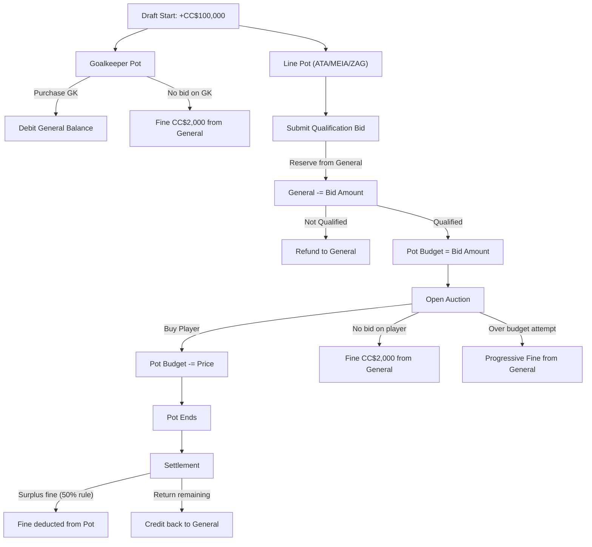

# Draft Database Tables Plan

## Context

The DRAFT regulation defines a CopaCoin (CC$) economy with integer-only values (increments of CC$1,000). Each cartola starts with CC$100,000 and must build a 10-player team (1 GK + 9 line players) through a structured pot/auction system. The current schema has no tables for balance tracking, bids, fines, purchases, or transfers.

## Existing tables to modify

### `championship_managers` — add draft-state columns

Currently lives at schema line 4-15 of the attached file, and typed in [types/manager.ts](types/manager.ts).

Add:
- `initial_balance` INTEGER DEFAULT 100000 — configurable starting balance
- `current_balance` INTEGER DEFAULT 100000 — cached general balance, kept in sync via app logic
- `draft_sort_order` INTEGER — order from the initial sorteo (team/letter pick order)

The `current_balance` is a **denormalized cache** for real-time display; the true balance can always be recomputed from `draft_balance_transactions`. This avoids expensive SUM queries during live draft operation.

---

## New tables

### 1. `draft_balance_transactions` — General balance audit ledger

Every change to a cartola's general CC$ balance produces a row here. Current balance = `SUM(amount)`.

| Column | Type | Notes |
|--------|------|-------|
| id | uuid PK | DEFAULT gen_random_uuid() |
| championship_id | uuid FK -> championships | |
| championship_manager_id | uuid FK -> championship_managers | |
| type | text NOT NULL | See enum below |
| amount | integer NOT NULL | Positive = credit, negative = debit |
| reference_id | uuid | Nullable FK to the originating event (purchase, fine, bid, etc.) |
| description | text | Nullable, human-readable |
| created_at | timestamptz DEFAULT now() | |

**Transaction types (text enum):**
- `INITIAL_BALANCE` — +100,000 at draft start
- `POT_BID_RESERVE` — debit when submitting qualification bid
- `POT_BID_REFUND` — credit when not qualified (full refund)
- `GOALKEEPER_PURCHASE` — debit for GK purchase (comes from general balance)
- `FINE_NO_BID_GOALKEEPER` — CC$2,000 fine when no one bids on a GK
- `FINE_NO_BID_PLAYER` — CC$2,000 fine when no one bids on a line player
- `FINE_REMAINING_BUDGET` — end-of-pot surplus fine
- `FINE_OVER_BUDGET` — progressive fine for bidding over pot budget
- `FINE_MANUAL` — manual fine by fiscal
- `POT_BUDGET_RETURN` — credit when pot ends (remaining after fine returns to general)
- `ADDITIONAL_ROUND_PURCHASE` — debit for additional round purchase

### 2. `draft_qualification_bids` — Blind bids for pot habilitacao

Each cartola submits one blind bid per pot to qualify for the open auction.

| Column | Type | Notes |
|--------|------|-------|
| id | uuid PK | |
| championship_id | uuid FK | |
| championship_manager_id | uuid FK | |
| pot_number | integer NOT NULL | Which pot (matches `draft_pots.pot_number`) |
| pot_position | text NOT NULL | ATA, MEIA, ZAG |
| bid_amount | integer NOT NULL | Min CC$1,000 |
| submitted_at | timestamptz NOT NULL | Precise timestamp for tiebreaking |
| qualified | boolean DEFAULT false | Set after all bids are processed |
| created_at | timestamptz DEFAULT now() | |

**Unique constraint:** `(championship_manager_id, championship_id, pot_number, pot_position)` — one bid per cartola per pot.

**Note:** The goalkeeper pot has NO qualification phase — all cartolas participate automatically.

### 3. `draft_pot_budgets` — Per-pot budget tracking for qualified cartolas

Created when a cartola qualifies for a line pot. Tracks their spending ceiling within that pot.

| Column | Type | Notes |
|--------|------|-------|
| id | uuid PK | |
| championship_id | uuid FK | |
| championship_manager_id | uuid FK | |
| pot_number | integer NOT NULL | |
| pot_position | text NOT NULL | |
| initial_budget | integer NOT NULL | = qualification bid amount |
| remaining_budget | integer NOT NULL | Updated on each purchase/fine |
| fine_amount | integer DEFAULT 0 | End-of-pot surplus fine applied |
| returned_amount | integer DEFAULT 0 | Amount returned to general balance |
| settled | boolean DEFAULT false | True after end-of-pot settlement |
| created_at | timestamptz DEFAULT now() | |

**Budget flow:**
1. Created with `initial_budget = remaining_budget = bid_amount`
2. On player purchase: `remaining_budget -= purchase_price`
3. On pot close: calculate fine (50% rule), set `fine_amount`, `returned_amount`, `settled = true`
4. `remaining_budget` after settlement should = 0

### 4. `draft_special_card_uses` — Special card activations

Records when a cartola activates their one-time special card.

| Column | Type | Notes |
|--------|------|-------|
| id | uuid PK | |
| championship_id | uuid FK | |
| activated_by_cm_id | uuid FK -> championship_managers | Who activated the card |
| pot_number | integer NOT NULL | |
| pot_position | text NOT NULL | |
| target_registration_id | uuid FK -> championship_registrations | Player being contested |
| won_by_cm_id | uuid FK -> championship_managers | Nullable, who won the blind auction |
| winning_bid_amount | integer | Nullable |
| result | text NOT NULL | `purchased` or `returned_to_auction` |
| created_at | timestamptz DEFAULT now() | |

**`result = 'returned_to_auction'`** occurs when all blind bids are CC$0 — the player goes back to the normal open auction. Card is still consumed.

A cartola has used their card if a row exists in this table with their `activated_by_cm_id` for that championship.

### 5. `draft_special_card_bids` — Blind bids during special card auction

When a special card is activated, all qualified cartolas in the pot with remaining budget submit blind bids.

| Column | Type | Notes |
|--------|------|-------|
| id | uuid PK | |
| championship_id | uuid FK | |
| championship_manager_id | uuid FK | |
| special_card_use_id | uuid FK -> draft_special_card_uses | |
| bid_amount | integer NOT NULL | Min CC$0 |
| submitted_at | timestamptz NOT NULL | Precise timestamp for tiebreaking |
| won | boolean DEFAULT false | |
| created_at | timestamptz DEFAULT now() | |

**Unique constraint:** `(special_card_use_id, championship_manager_id)` — one bid per cartola per special card event.

### 6. `draft_player_purchases` — Player purchase records

Records every player acquisition with price and context. This is the answer to "quanto cada cartola gastou por jogador".

| Column | Type | Notes |
|--------|------|-------|
| id | uuid PK | |
| championship_id | uuid FK | |
| championship_manager_id | uuid FK | Who bought |
| registration_id | uuid FK -> championship_registrations | The player |
| pot_number | integer NOT NULL | |
| pot_position | text NOT NULL | |
| purchase_price | integer NOT NULL | CC$ paid |
| purchase_type | text NOT NULL | `open_auction`, `special_card`, `additional_round` |
| created_at | timestamptz DEFAULT now() | |

**Note:** When a purchase is recorded, the app should also insert the corresponding row into `championship_team_players` (team composition) and create the appropriate `draft_balance_transactions` / update `draft_pot_budgets`.

### 7. `draft_fines` — All fines applied

Centralized registry of every fine, both automatic and manual.

| Column | Type | Notes |
|--------|------|-------|
| id | uuid PK | |
| championship_id | uuid FK | |
| championship_manager_id | uuid FK | |
| type | text NOT NULL | `no_bid_goalkeeper`, `no_bid_player`, `remaining_budget`, `over_budget`, `manual` |
| amount | integer NOT NULL | Always positive |
| pot_number | integer | Nullable (manual fines may not relate to a pot) |
| pot_position | text | Nullable |
| description | text | Nullable, for manual fines |
| is_automatic | boolean DEFAULT true | |
| occurrence_number | integer | For progressive fines (`over_budget`): 1st, 2nd, 3rd... |
| applied_by | uuid | Nullable FK -> profiles (the fiscal who applied manual fines) |
| created_at | timestamptz DEFAULT now() | |

**Progressive fine logic** (`over_budget` type): `amount = occurrence_number * 2000`. The `occurrence_number` is computed across the entire draft, not per pot.

### 8. `draft_transfers` — Transfer window trades

Records 1:1 player swaps during the 5-minute transfer window.

| Column | Type | Notes |
|--------|------|-------|
| id | uuid PK | |
| championship_id | uuid FK | |
| manager_a_cm_id | uuid FK -> championship_managers | |
| manager_b_cm_id | uuid FK -> championship_managers | |
| player_a_registration_id | uuid FK -> championship_registrations | Player going FROM A to B |
| player_b_registration_id | uuid FK -> championship_registrations | Player going FROM B to A |
| registered_by | uuid | Nullable FK -> profiles (the fiscal) |
| created_at | timestamptz DEFAULT now() | |

**On transfer:** The app must also update `championship_team_players` to swap the players between teams.

---

## General balance flow diagram



## Pot budget settlement logic (50% rule)

```
remaining = pot_budget.remaining_budget
if remaining == 0:
    fine = 0
elif remaining is even:
    fine = remaining / 2
else:
    fine = (remaining - 1000) / 2

returned = remaining - fine
```

---

## Additional considerations the user should be aware of

1. **`championship_team_players`** already exists in the DB but is NOT wired into the app code yet. It will serve as the team composition table — each purchase and transfer should update it.

2. **Draft session state tracking** — Consider adding a `draft_current_state` table or columns on `championships` to track which pot is active, what phase (habilitacao/auction), timer state, etc. This would support the real-time app experience. Not strictly a "data table" but useful for app flow.

3. **Pot execution order** — The regulation defines: ATA -> MEIA -> ZAG -> GOL -> ZAG -> MEIA -> ATA. The existing `draft_pots.pot_order` may partially handle this, but a `draft_pot_schedule` table could explicitly define the execution sequence for a championship.

4. **Cartola auto-release** — When a cartola's team reaches 10 players (1 GK + 9 line), they're automatically excluded from further pots. This can be derived from `championship_team_players` count, no extra table needed.

5. **Additional round** — The `draft_player_purchases` table handles this with `purchase_type = 'additional_round'`. A `draft_sort_order` on `championship_managers` can track the re-sorted order for this round.

---

## Implementation approach

- Create all tables via a single Supabase SQL migration
- Add appropriate indexes on frequently queried columns (championship_id, championship_manager_id)
- Add RLS policies as needed (based on existing app auth patterns)
- Update TypeScript types in `types/` to match new tables
- Wire `championship_team_players` into the app if not already done
